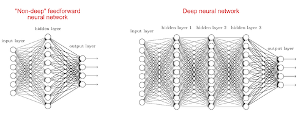
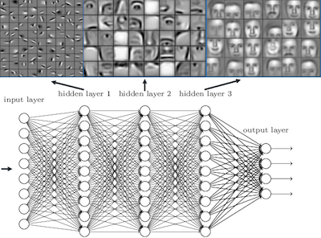
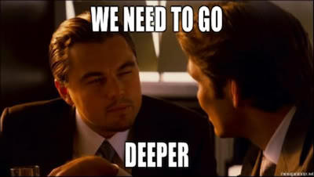
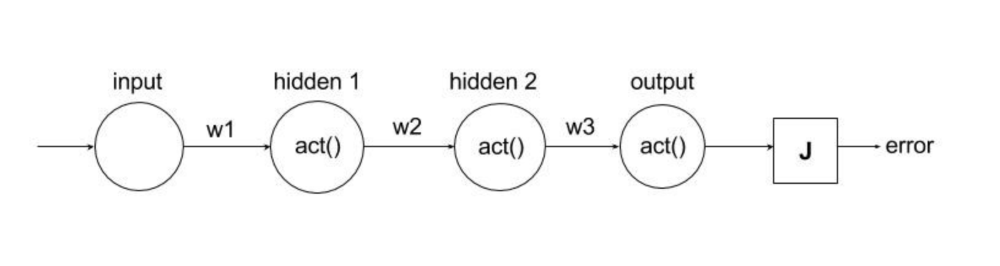

Vanishing Gradients.
====================

Disclaimer
^^^^^^^^^^

This is a discussion on an old problem that hindered the Machine
Learning research for decades, now partially solved using various
methods discovered in last 10 years. The audience are expected to have
basic understanding of Neural Networks and Backpropagation to reap
maximum benefit out of the explanations followed.

Neural Networks and Deep Neural Networks
----------------------------------------

We all are beholding the captivating wizardry of Deep Learning in
various applications. With Deep Learning, tedious tasks of past like
Translation, Image Recognition, Object Detection and Speech Recognition
are now working par with human level accuracy. There must be some spell,
Deep Learning is casting, to perform these sophisticated tasks, isn't
it? :D

Let's answer that question first, shall we? So, what is "Deep" is Deep
Learning?

Obviously, it is the depth of the architecture or simply put, it is the
number of layers we add to a shallow network to make it deep.

   Title

The next question is why more layers?

As the number of layers increases, `deep networks can represent very
complex functions <https://arxiv.org/pdf/1409.1556.pdf>`__. It can also
learn features at many different levels of abstraction, from edges (at
the lower layers) to very complex features (at the deeper layers).
Consider an image recognition example below. `As we all know, in image
recognition, Deep Networks surpassed human level
accuracy <https://www.theguardian.com/global/2015/may/13/baidu-minwa-supercomputer-better-than-humans-recognising-images>`__.

   Title

As we see, the initial layers can detect the naive patterns like edges,
then middle layers learn more complex patterns like nose, lips etc. and
finally, the deepest layers learn the entire face. Woo-Hoo!!

So the point is, **depth matters** and it is helpful to learn more and
more details from the input. Next time when we confront a complex
problem to be solved by Deep Learning, what would be the first fix, if
patterns are not learned well? Leo knows the solution :D

   Title

What is wrong with Deep Neural Networks ?
-----------------------------------------

Everything in this world has it's price. Though, the power of deep
networks is immense, training a deep network is not that easy. No, I'm
not talking about the hardware limitations which is indeed a practical
problem. But in litrature, there are many fundamental issues we face
while training deep networks.

Now, you may get deluded a bit, thinking that these issues are due to
complex architectures of deep networks. In contrast, root of these
issues are linked with learning algorithms like backpropagation, we use
to train them.

::

    Wait, what? Reputation of backpropagation is on the line? :o
    Yeah, kind of :D 

Let's make a brief discussion on what actually happens in
backpropagation. For that, consider the following network.

::

    It is not deep enough :/
    But helpful for explaining the concept :P 

   Title

For simplicity, we are going to make some assumptions.

-  Biases are zero
-  Activation function :math:`g` is identity function in all layers.

   -  So, effectively, it is as good as it gets, there is no activation.

      -  Please not this point carefully since, it is going to make a
         lot of easiness in our calculations.

::

    These assumptions are odd :/
    We'll come back to a fully fledged example once we answer the question stated in section heading :)
    Okay :/

We compute a cost :math:`J` on forward direction, traversing from first
layer to last layer. This is called feed forward propagation. This cost
function tell us about the error between the expected output :math:`y`
and computed output :math:`\hat y`.

How do we calculate :math:`\hat y` ? It is the product of activations of
each layer.

Layer 1 output, :math:`Z^1` = :math:`W^1 * X`

Activation of layer 1, :math:`A^1` = :math:`g(Z^1) = W^1 * X`

Layer 2 output, :math:`Z^2` = :math:`W^2` \* Activation of layer 1 =
:math:`W^2 * W^1 * X`

Activation of layer 2, :math:`A^2` =
:math:`g(Z^2) = g(W^2 * W^1 * X) = W^2 * W^1 * X`

Layer 3 output, :math:`Z^3` = :math:`W^3` \* Activation of layer 2 =
:math:`W^3 * W^2 * W^1 * X`

Activation of layer 3, :math:`\hat y` or :math:`A^3` =
:math:`g(Z^3) = g(W^3 * W^2 * W^1 * X ) = W^3 * W^2 * W^1 * X`

Then,

.. math:: \hat y\ =\ W^3 * W^2 * W^1 * X

Cost or Error, :math:`J` = :math:`\hat y\ -\ y` = :math:`A^3\ -\ y`

To perform this minimization process, Gradient Descent is going to
adjust the parameters, i.e. weights of our network. This is the so
called "learning" part in Deep Learning.

First, it'll calculate gradients/derivatives of cost function with
respect to parameters of final layer. But, that gradient depends on
previous layer parameters since the layers are stacked one on another.
So we need to calculate previous layer gradients, and substitute those
values in current layer equations. The entire network follows this
pattern.

I know you're scratching your head :D Let's represent it mathematically.

Since the activation is identiy, :math:`\frac{\partial A}{\partial Z}`
will be always 1. We'll substitute this condition in following
equations.

+------------------------------------------------------------+
| So, first we calculate gradient at third layer with        |
| respect to cost.                                           |
+------------------------------------------------------------+
| .. math::                                                  |
|                                                            |
|                                                            |
|    \begin{align}                                           |
|    & \frac{\partial J}{\partial W^3}\ = \ \frac{\partial J |
| }{\partial A^3} * \frac{\partial A^3}{\partial Z^3} * \fra |
| c{\partial Z^3}{\partial W^3} \\\\                         |
|    & \frac{\partial J}{\partial W^3}\ =\ \frac{\partial}{\ |
| partial A^3}(A^3\ -\ y) * 1 * \frac{\partial}{\partial W^3 |
| } (W^3 * W^2 * W^1 * X)\\\\                                |
|    & \frac{\partial J}{\partial W^3}\ = 1 * W^2 * W^1 * X  |
|    \end{align}                                             |
+------------------------------------------------------------+

For second layer,

.. math::

   \begin{align}
   & \frac{\partial J}{\partial W^2}\ = \ \frac{\partial J}{\partial A^3} * \frac{\partial A^3}{\partial Z^3} * \frac{\partial Z^3}{\partial A^2} * \frac{\partial A^2}{\partial Z^2} * \frac{\partial Z^2}{\partial W^2} \\\\
   & \frac{\partial J}{\partial W^2}\ =\ \frac{\partial (A^3\ -\ y)}{\partial A^3} * 1 * \frac{\partial (W^3 * W^2 * W^1 * X)}{\partial (W^2 * W^1 * X)} * 1 * \frac{\partial (W^2 * W^1 * X)}{\partial W^2}\\\\
   & \frac{\partial J}{\partial W^2}\ = 1 * W^3 * W^1 * X 
   \end{align}

+-------------------------------------------------------------+
| And finally,                                                |
+-------------------------------------------------------------+
| .. math::                                                   |
|                                                             |
|                                                             |
|    \begin{align}                                            |
|    & \frac{\partial J}{\partial W^1}\ = \ \frac{\partial J} |
| {\partial A^3} * \frac{\partial A^3}{\partial Z^3} * \frac{ |
| \partial Z^3}{\partial A^2} * \frac{\partial A^2}{\partial  |
| Z^2} * \frac{\partial Z^2}{\partial A^1} * \frac{\partial A |
| ^1}{\partial Z^1} * \frac{\partial Z^1}{\partial W^1}\\\\   |
|    & \frac{\partial J}{\partial W^1}\ =\ \frac{\partial (A^ |
| 3\ -\ y)}{\partial a^3} * 1 * \frac{\partial (W^3 * W^2 * W |
| ^1 * X)}{\partial (W^2 * W^1 * X)} * 1 * \frac{\partial (W^ |
| 2 * W^1 * X)}{\partial (W^1 * X)} * 1 * \frac{\partial (W^1 |
|  * X)}{\partial W^1}\\\\                                    |
|    & \frac{\partial J}{\partial W^1}\ = 1 * W^3 * W^2 * X   |
|    \end{align}                                              |
+-------------------------------------------------------------+

We call this circus, Chain rule in calculus :D So a computational train
starting from final layer, "propagates" upto first layer and thus the
name "Back Propagation" :P

Now, what is essentially "back propagated"? It's the gradients which
represents the rate at which the error changes with respect to
parameters in each layer!

If everything goes right, i.e. **all gradients are calculated
finitely**, then we'll be able to update every weights and biases in the
network at the end of one epoch. Intuitively, the updation of parameters
reflects how the change in network output is going to affect the
parameters in various layers. This process is cycled until a certain
number of epochs or definite admissable error is reached. Now we're
ready to understand the problem of vanishing gradients in detail.

Let's imagine, if all weights are same :math:`W`, we can consider two
possible cases for the value :math:`W`.

::

    You are making a lot of assumptions. And this one is ridiculous. Rule number 1 is you shall not use same weights in a neural network :@
    I know :) 
    That symmetry will result in useless linear learners :@
    I know that too, are you done? :)
    NO ! Yeah ... yes :@
    This assumption is solely intended for getting a better understanding of the issue. Let's continue :) 

Here we have 3 layers, but let's generalize for :math:`L` layers.

1. :math:`W>I` for I = Identity matrix

.. math:: \frac{\partial J}{\partial W^1} = W^L * X

Since W is greater than 1, the resulting value will be exponentially
high. This is called Exploding gradients.

2. :math:`W<I` for I = Identity matrix

.. math:: \frac{\partial J}{\partial W^1} = W^L * X

The victims
-----------

::

    Let me ask you something, How severe vanishing gradient is going to each layer? ;)
    Gradients are everywhere, so it should be the same effect, right? :/
    So, the middle layer and first layer are affected equally? ;)
    :/

No, it's not. Why? Let's consider the same network with sigmoid
activation and weights are not same anymore :D

We know that sigmoid function,

.. math:: S\ =\ \frac{1}{1+e^-x}

Derivative of sigmoid function,

.. math:: \frac{\partial S}{\partial x}\ =\ \frac{e^-x}{(1 + e^-x)^2}

Now, let's calculate the gradients in final layer and first layer.

--------------

.. math::

   \begin{align}
   & \frac{\partial J}{\partial W^3}\ = \ \frac{\partial J}{\partial A^3} * \frac{\partial A^3}{\partial Z^3} * \frac{\partial Z^3}{\partial W^3} \\\\
   & \frac{\partial J}{\partial W^3}\ =\ \frac{\partial}{\partial a^3}(A^3\ -\ y) * \frac{e^{-Z^2}}{(1 + e^{-Z^2})^2} *  \frac{\partial}{\partial W^3} (W^3 * W^2 * W^1 * X)\\\\
   & \frac{\partial J}{\partial W^3}\ = 1 * W^2 * \frac{e^{-Z^2}}{(1 + e^{-Z^2})^2} * W^1 * X 
   \end{align}

--------------

.. math::

   \begin{align}
   & \frac{\partial J}{\partial W^1}\ = \ \frac{\partial J}{\partial A^3} * \frac{\partial A^3}{\partial Z^3} * \frac{\partial Z^3}{\partial A^2} * \frac{\partial A^2}{\partial Z^2} * \frac{\partial Z^2}{\partial A^1} * \frac{\partial A^1}{\partial Z^1} * \frac{\partial Z^1}{\partial W^1}\\\\
   & \frac{\partial J}{\partial W^1}\ = 1 * \frac{e^{-Z^3}}{(1 + e^{-Z^3})^2} * W^3 * \frac{e^{-Z^2}}{(1 + e^{-Z^2})^2} * W^2 * \frac{e^{-Z^1}}{(1 + e^{-Z^1})^2} * X 
   \end{align}

--------------

As we see, gradient at final layer goes through only 3 multiplications
and first layer requires seven. Consider the following calculation and
you'll understand what I'm getting at.

.. math::

   \begin{align}  
   & 0.99^3 = 0.970299\\\\
   & 0.99^7 = 0.9320653479\\\\
   & 0.99^{100} = 0.36603234127\\\\
   & 0.99^{300} = 0.04904089407  
   \end{align}

As we propagate away from final layer, the perturbation on network
output will not reach the layers, even if reaches, the gradient will be
too feeble to make an update. This issue get worsened when number of
layers increases. Very deep networks often have a gradient signal that
goes to zero quickly because of this reason, thus making gradient
descent unbearably slow. More specifically, during gradient descent, as
we backprop from the final layer back to the first layer, we are
multiplying by the weight matrix on each step, and thus the gradient can
decrease exponentially quickly to zero. Gradient based methods learn a
parameter's value by understanding how a small change in the parameter's
value will affect the network's output. If a change in the parameter's
value causes very small change in the network's output - the network
just can't learn the parameter effectively.

.. raw:: html

   <caption>

.. raw:: html

   

 **Figure 1** : **Vanishing gradient** The speed of learning decreases
very rapidly for the early layers as the network trains

.. raw:: html

   

.. raw:: html

   </caption>

So, which layer is going to suffer the most? Obviously the initial
layers. Now think about it, in image recognition we saw that initial
layers are the learning the building blocks like edges, if they are
learned wrong, then you know...

So that's it. We defined the problem pretty comphrehensive. Now do we
have any remedies?

Remedies
--------

Well I've a sad news for you. There is no complete cure for vanishing
gradient yet, but we've some remarkable advancements to reduce the
effect. We'll discuss some techniques and it's consequences.

+-----------------------------------------------------------------------+
| **Initializing the weights with standard techniques like Xavier       |
| Intialization** - Initializing weights properly can reduce to some    |
| extend since the fact both too high or too low weights can result in  |
| exploding/vanishing gradients.                                        |
+=======================================================================+
| **The curse of Sigmoids and Tanhs**                                   |
+-----------------------------------------------------------------------+
| We saw Sigmoid function above used as the activation in our network.  |
| Let's see the graph of this function and it's derivative.             |
+-----------------------------------------------------------------------+
| |Title|                                                               |
+-----------------------------------------------------------------------+
| Let's make some observations from these graphs.                       |
+-----------------------------------------------------------------------+
| a. Sigmoid is confined to the interval :math:`[0,\ 1]`, the output    |
| will be always between these interval for any input.                  |
+-----------------------------------------------------------------------+
| Even if we consider to initialize the weights as big as say           |
| :math:`[-400,\ 400]`, after the activation, that will a binay matrix. |
| High values tend to 1 and low values to 0. This will make derivatives |
| zero and thus vanishing gradients.                                    |
+-----------------------------------------------------------------------+
| b. The maximum value of derivative of sigmoid function is 0.25        |
+-----------------------------------------------------------------------+
| So by default, the input weights get :math:`(\frac{1}{4})^{th}` of    |
| the original value on calculating the gradients, since derivative     |
| :math:`\frac{\partial A}{\partial Z}` is multiplied with it.          |
+-----------------------------------------------------------------------+
| Same are applicable to tanh which is an extended sigmoid.             |
+-----------------------------------------------------------------------+
| So the take away is don't use them :D                                 |
+-----------------------------------------------------------------------+

**Dying ReLUs**

Let's plot Rectified Linear Units and it's derivative.

.. figure:: images/relu.png
   :alt: Title

   Title

What are the observations?

a. ReLUs don't suffer from limited interval problem like sigmoid. The
   minimum value is 0 but there is no limit for maximum value.

b. If the input value is less than zero, then output and derivative are
   zero.

This will eliminate all the negative inputs which is okay. But
derivatives getting zero is a problem. This means, in the entire
training, that neuron which can't fire above zero will remain unlearned
or dead.

So, ReLU is also not the perfect solution, but provides a great relief.

+-----------------------------------------------------------------------+
| **Gating mechanisms in Long Short Term Memory Cells (LSTMs) and Gated |
| Recurrent Units (GRUs)**                                              |
+-----------------------------------------------------------------------+
| In sequence learning, the issue of exploding/vanishing gradients is   |
| dire, the gated architecture helps to reduce the effect. Read about   |
| this in real detail at                                                |
| `here <http://www.cs.toronto.edu/~rgrosse/courses/csc321_2017/reading |
| s/L15%20Exploding%20and%20Vanishing%20Gradients.pdf>`__.              |
+-----------------------------------------------------------------------+

**ResNets**

`**Deep Residual Learning for Image Recognition by Kaiming He, Xiangyu
Zhang, Shaoqing Ren and Jian Sun at Microsoft
Research** <https://arxiv.org/pdf/1512.03385.pdf>`__ provides a new
architecture to solve the problem of training deep networks.

Now let me tell you the story behind this whole tutorial on Vanishing
Gradients. I wanted to write a tutorial on ResNets paper, but when
started I had this feeling that without giving a proper definition on
the problem we are going to solve with ResNets, the whole tutorial would
be incomplete. So I started working on this tutorial, which you may find
as a preamble to ResNets tutorial :D So that's it. See you in ResNets
tutorial.

Cheers :)

.. |Title| image:: images/sigmoid_derivative.png
